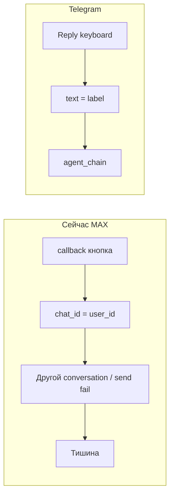
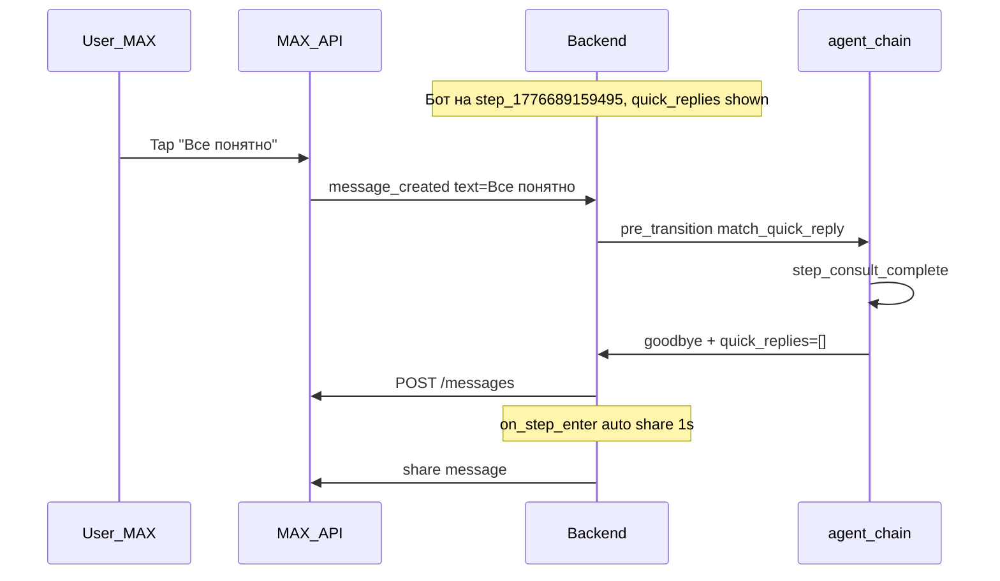

# План: MAX quick reply как в Telegram

План реализации для агента «Дай Лапу» (`day_lapu_tat_yana_vetirinarnyy_pomoshchnik_2`).

**Цель:** довести кнопки «Все понятно» и «Еще есть вопросы» в MAX до паритета с Telegram — доставка текста в агент, детерминированные переходы workflow, корректная цепочка share только после «Все понятно».

Связанный документ (расширенный контекст): [`max-workflow-buttons-fix-plan.md`](max-workflow-buttons-fix-plan.md).

---

## Цель

После реализации нажатие **«Все понятно»** и **«Еще есть вопросы»** в MAX должно работать так же, как в Telegram:

| Действие | Ожидаемый результат |
|----------|---------------------|
| **Все понятно** | Переход на `step_consult_complete` → короткое прощание → share через ~1 с → follow-up через ~5 с |
| **Еще есть вопросы** | Остаётся на шаге «Дать ответ» → приглашение задать вопрос → снова две кнопки, **без** share |
| Обычный текст | Как сейчас — ответ на текущем шаге |

---

## Текущие проблемы (корень)



1. **Транспорт MAX**: кнопки `type: callback` + синтетический `message_created` с неверным `chat_id` (`backend/app/services/max_service.py`, строки 207–260).
2. **Workflow**: переход «Все понятно» через LLM YES/NO без `match_quick_reply` (`backend/app/chains/agent_chain.py`, `node_pre_transition`).
3. **Share**: `auto_recommendation_share` на `on_step_exit` шага «Дать ответ» — может срабатывать при любом уходе (`backend/tests/fixtures/day_lapu_vet_schedule_anchor_agent.json`).

---

## Чеклист реализации

- [x] **Фаза 1.1** — Перевести `_build_max_inline_keyboard` на `type: message` (payload = label)
- [x] **Фаза 1.2** — Починить `_handle_message_callback` (chat_id, payload fallbacks, logging)
- [x] **Фаза 1.3** — Добавить `backend/tests/test_max_quick_reply_buttons.py`
- [x] **Фаза 2.1** — Добавить `match_quick_reply` в `WorkflowTransition` (BE + FE types)
- [x] **Фаза 2.2–2.3** — `_try_quick_reply_transition` + LLM hint в `agent_chain.py`
- [x] **Фаза 2.4** — Обновить fixture (transitions + auto_steps) и prod agent config
- [x] **Фаза 2.5** — `test_quick_reply_transition.py` + обновить `test_day_lapu_schedule_anchor_scenario.py`
- [ ] **Фаза 3** — Прогнать pytest и ручной чеклист в MAX

---

## Фаза 1 — Транспорт MAX (критично)

### 1.1 Quick reply-кнопки: `type: message`

Файл: `backend/app/services/max_service.py`, функция `_build_max_inline_keyboard`.

Заменить `type: "callback"` + JSON payload на формат MAX API:

```python
{
    "type": "message",
    "text": label[:40],
    "payload": label[:1024],  # текст, который MAX отправит боту как message_created
}
```

Поведение: MAX сам шлёт webhook `message_created` с `body.text = "Все понятно"` — **тот же путь**, что у обычного текста и у Telegram ReplyKeyboard.

Payment-кнопки в `_build_max_payment_keyboard` **не трогать** — остаются `callback` / `link`.

### 1.2 Fallback: починить `_handle_message_callback`

Для **уже отправленных** сообщений со старыми `callback`-кнопками и для `/restart`, `pay`:

- `chat_id` брать из `payload["message"]["recipient"]["chat_id"]`, fallback `recipient.user_id`
- `user_id` отправителя — из `callback["user"]["user_id"]`
- Разбор текста кнопки (каскад):
  1. JSON `{"cmd":"reply","text":"..."}`
  2. plain string payload
  3. поиск label в `message.body.attachments` → `inline_keyboard` по совпадению payload
- Синтетическое сообщение строить с **реальным** `recipient` из callback webhook, не подставляя `user_id` в `chat_id`
- Добавить `logger.warning` при нераспознанном payload (сейчас silent fail)

### 1.3 Тесты транспорта

Новый файл: `backend/tests/test_max_quick_reply_buttons.py`

- `_build_max_inline_keyboard(["Все понятно", "Еще есть вопросы"])` → `type: message`, payload = label
- `_handle_message_callback` с реальным payload MAX (plain string + JSON) → вызывает pipeline с правильным `chat_id`
- Старый callback JSON `{"cmd":"reply","text":"..."}` → backward compat

---

## Фаза 2 — Детерминированный workflow (паритет с Telegram)

### 2.1 Модель: `match_quick_reply`

Файлы:

- `backend/app/models/agent_config.py` — `WorkflowTransition.match_quick_reply: Optional[str]`
- `frontend/lib/utils/agentConfig.ts` и `frontend/lib/types/agent.ts` — то же поле
- `frontend/lib/utils/agentConfig.ts` — сериализация в PUT agent (round-trip)

UI в админке **не обязателен** в первой итерации — поле можно задать через fixture / PUT API; при желании позже добавить input в StepPanel transitions.

### 2.2 Логика в `node_pre_transition`

Файл: `backend/app/chains/agent_chain.py`

Добавить `_try_quick_reply_transition(state, step, step_map) -> Optional[str]` **до** LLM-цикла (после collection gate):

1. `user_message = state["user_message"].strip()`
2. Если `user_message not in step.quick_replies` → skip (защита от stale-кнопок на других шагах)
3. Найти transition с `match_quick_reply == user_message` → вернуть `next_step_id`, вызвать `_finalize_transition_outcome`, **без LLM**
4. Если quick reply нажат, но matching transition нет → остаться на шаге (кейс «Еще есть вопросы»)

### 2.3 Подсказка LLM для «Еще есть вопросы»

Файл: `backend/app/chains/agent_chain.py`, `node_step_executor`

Если `user_message in step.quick_replies` и deterministic transition не сработал — добавить в step prompt одну строку:

> «Пользователь нажал кнопку «{label}». Ответь по сценарию этой кнопки, не завершай консультацию.»

### 2.4 Обновление конфига агента

Файл: `backend/tests/fixtures/day_lapu_vet_schedule_anchor_agent.json`

На шаге `step_1776689159495` («Дать ответ»):

| Transition | Изменение |
|------------|-----------|
| → `step_consult_complete` | добавить `"match_quick_reply": "Все понятно"` |
| → `step_3` («новый вопрос») | **удалить** (источник ложного exit + share) |

Auto-steps:

| auto_step | Было | Станет |
|-----------|------|--------|
| `auto_recommendation_share` | `source_id: step_1776689159495`, `on_step_exit` | `source_id: step_consult_complete`, `on_step_enter`, `delay_seconds: 1` |
| `auto_1776696721697` (24h) | `on_step_exit` от «Дать ответ» | `on_step_exit` от `step_consult_complete` |

**Production**: после деплоя обновить конфиг агента `day_lapu_tat_yana_vetirinarnyy_pomoshchnik_2` (админка PUT или migration script) — иначе prod останется со старым workflow.

### 2.5 Тесты workflow

Новый файл: `backend/tests/test_quick_reply_transition.py`

- «Все понятно» на `step_1776689159495` → `step_consult_complete` без mock LLM evaluator
- «Все понятно» на `step_privacy` → transition **не** срабатывает (stale button guard)
- «Еще есть вопросы» → остаётся на `step_1776689159495`

Обновить `backend/tests/test_day_lapu_schedule_anchor_scenario.py`:

- share планируется при **enter** на `step_consult_complete`, не exit с «Дать ответ»
- `test_chat_api_post_message_calls_schedule_auto_step_for_exit_anchor` → переименовать/переписать под `on_step_enter`

---

## Фаза 3 — Проверка end-to-end

### Ручной чеклист (MAX)

1. Дойти до ответа с кнопками на шаге «Дать ответ»
2. **Еще есть вопросы** → ответ-приглашение, кнопки снова, share **нет**
3. **Все понятно** → прощание → share ~1 с → «я рядом» ~5 с
4. Написать новый вопрос после завершения → бот отвечает (transition на `step_3` с `step_consult_complete`)

### Автотесты

```bash
cd backend && pytest tests/test_max_quick_reply_buttons.py tests/test_quick_reply_transition.py tests/test_day_lapu_schedule_anchor_scenario.py -q
```

### Логи при деплое

- `update_type=message_created` + `body.text=Все понятно` (новые кнопки)
- `update_type=message_callback` только для старых сообщений / pay
- `Pre-transition: quick_reply match` в agent_chain

---

## Целевой поток (после всех фаз)



---

## Вне scope (отдельная задача)

- Видео-приветствие MAX при `/restart` ([`max-workflow-buttons-fix-plan.md`](max-workflow-buttons-fix-plan.md), фаза 3)
- Миграция `platform-api.max.ru` → `platform-api2.max.ru`
- UI поля `match_quick_reply` в WorkflowCanvas (опционально позже)

---

## Риски

| Риск | Митигация |
|------|-----------|
| Старые callback-кнопки в чатах | Fallback в `_handle_message_callback` |
| Prod config не обновлён | Явный шаг: PUT agent после деплоя |
| `type: message` не поддерживается старым клиентом MAX | Проверить на staging; fallback callback остаётся |

---

## Затронутые файлы (итого)

- `backend/app/services/max_service.py` — кнопки + callback
- `backend/app/chains/agent_chain.py` — quick reply transitions
- `backend/app/models/agent_config.py` — модель
- `frontend/lib/utils/agentConfig.ts`, `frontend/lib/types/agent.ts` — типы
- `backend/tests/fixtures/day_lapu_vet_schedule_anchor_agent.json` — конфиг
- Новые/обновлённые тесты в `backend/tests/`
