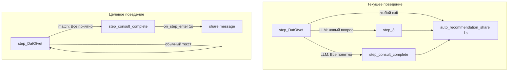
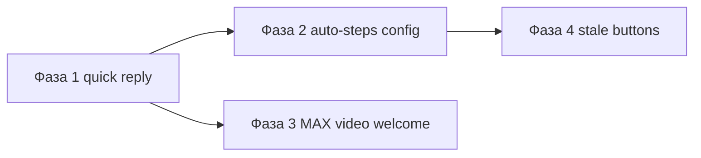

# План: кнопки, share и видео-приветствие в MAX

План реализации для агента «Дай Лапу» (`day_lapu_tat_yana_vetirinarnyy_pomoshchnik_2`).

**Цель:** исправить три связанные проблемы — детерминированная обработка quick reply-кнопок, корректная цепочка «поделись с друзьями» после «Все понятно», видео-приветствие в MAX при `/restart`.

---

## Диагностика (подтверждено кодом + production БД)



| Проблема | Корневая причина |
|----------|------------------|
| Share «случайно» | `auto_recommendation_share` привязан к `on_step_exit` шага «Дать ответ»; срабатывает при **любом** уходе, в т.ч. через лишний transition → `step_3` (есть только в production) |
| «Все понятно» в MAX — 0/5 share | Переход на `step_consult_complete` идёт через LLM YES/NO в `node_pre_transition` — часто NO; checkpoint остаётся на `step_privacy` |
| Кнопки «не работают» | Stale inline-клавиатура MAX + ответ генерируется на неверном шаге |
| Нет кружка в MAX | `intro_video_note_file_id` отправляется только для Telegram (`video_note`) |

Ключевые файлы:

- `backend/tests/fixtures/day_lapu_vet_schedule_anchor_agent.json`
- `backend/app/chains/agent_chain.py`
- `backend/app/services/bot_commands_service.py`
- `backend/app/services/max_service.py`

---

## Фаза 1 — Детерминированные quick reply (критично)

### 1.1 Модель: поле `match_quick_reply` на transition

Файл: `backend/app/models/agent_config.py`

Добавить в `WorkflowTransition`:

```python
match_quick_reply: Optional[str] = Field(
    default=None,
    description="If set, transition fires when user_message exactly matches this quick-reply label (before LLM evaluator)."
)
```

### 1.2 Логика в `pre_transition`

Файл: `backend/app/chains/agent_chain.py`, функция `node_pre_transition` — **до** LLM-цикла по transitions (после collection gate):

1. Взять `user_message = state.get("user_message", "").strip()`
2. Если `user_message` **не** входит в `step.quick_replies` — пропустить quick-reply matching (защита от stale-кнопок на `step_privacy` и др.)
3. Если входит — найти transition с `match_quick_reply == user_message` → сразу `new_step_id = transition.next_step_id`, вызвать `_finalize_transition_outcome`, **не** вызывать LLM evaluator
4. Если quick reply нажат, но transition с `match_quick_reply` не найден — **остаться на шаге** (кейс «Еще есть вопросы»)

Вспомогательная функция (в том же файле):

```python
def _try_quick_reply_transition(state, step, step_map) -> Optional[str]:
    ...
```

### 1.3 Подсказка LLM для «Еще есть вопросы»

Файл: `backend/app/chains/agent_chain.py`, `node_step_executor`

Если `user_message` совпадает с quick reply текущего шага, но transition не сработал — добавить в step prompt одну строку:

> «Пользователь нажал кнопку «{label}». Ответь по сценарию этой кнопки, не завершай консультацию.»

### 1.4 Обновление конфига агента (production + fixture)

Файлы:

- `backend/tests/fixtures/day_lapu_vet_schedule_anchor_agent.json`
- production agent `day_lapu_tat_yana_vetirinarnyy_pomoshchnik_2` (через админку или migration script)

На шаге `step_1776689159495`:

| Transition | Изменение |
|------------|-----------|
| → `step_consult_complete` | добавить `"match_quick_reply": "Все понятно"` |
| → `step_3` («новый вопрос») | **удалить** (источник ложных exit + share) |

На шаге `step_consult_complete` оставить LLM-transition → `step_3` для новых вопросов после завершения.

### 1.5 Тесты

Новый файл: `backend/tests/test_quick_reply_transition.py`

- «Все понятно» на `step_1776689159495` → `step_consult_complete` без mock LLM
- «Все понятно» на `step_privacy` → transition **не** срабатывает
- «Еще есть вопросы» → остаётся на `step_1776689159495`

Обновить: `backend/tests/test_day_lapu_schedule_anchor_scenario.py` — pending_auto при переходе на `step_consult_complete` должен планироваться с `source_id=step_consult_complete`, не `step_1776689159495`.

---

## Фаза 2 — Share только после «Все понятно»

### 2.1 Перенос auto-steps в workflow config

Изменить `auto_steps` (fixture + production):

| auto_step | Было | Станет |
|-----------|------|--------|
| `auto_recommendation_share` | `source_id: step_1776689159495`, `on_step_exit` | `source_id: step_consult_complete`, `on_step_enter`, `delay_seconds: 1` |
| `auto_1776696721697` (24h follow-up) | `on_step_exit` от «Дать ответ» | `on_step_exit` от `step_consult_complete` |
| `auto_after_share_followup` | без изменений (цепочка от share) | без изменений |
| `auto_7day_reactivation` | без изменений | без изменений |

Целевая цепочка после клика «Все понятно»:

```
pre_transition → step_consult_complete
  → LLM: короткое прощание (~2-5 сек)
  → +1 сек: auto_recommendation_share
  → +5 сек: auto_after_share_followup
```

### 2.2 Код: без изменений в `agent_reply_coordinator`

`_finalize_transition_outcome` уже планирует `on_step_enter` autos при `new_step_id != entry_step_id`. Достаточно смены конфига.

### 2.3 Тесты

- Обновить `backend/scripts/e2e_full_flow_test.py` / unit-тест: share **не** планируется при обычном ответе на «Дать ответ»; планируется только при входе на `step_consult_complete`
- Проверить `cancel_on_workflow_step_change: true` — share отменяется, если пользователь сразу пишет новый вопрос до срабатывания auto

---

## Фаза 3 — Видео-приветствие в MAX при /restart

### 3.1 Новый шаблон в prompts.templates

Добавить поле (модель + админка + fixture):

- `max_intro_video_url` — публичный URL видео (Cloudinary/S3), квадратное, до ~60 сек
- опционально `restart_welcome_followup` — второй текстовый блок (смысл «кружочка», если не вошёл в видео)

Файлы модели/фронта:

- `backend/app/models/agent_config.py` — `PromptTemplates` (если есть typed model)
- `frontend/lib/types/agent.ts` + форма шаблонов в админке (минимальное поле URL)

### 3.2 Отправка в `handle_restart`

Файл: `backend/app/services/bot_commands_service.py`

После блока Telegram `video_note`:

```python
if not _is_telegram:
    video_url = tpl.get("max_intro_video_url", "").strip()
    if video_url:
        await send_fn("", media_url=video_url, media_type="video")  # расширить send_fn
        await asyncio.sleep(1)
    followup = tpl.get("restart_welcome_followup", "").strip()
    if followup:
        await send_fn(followup)
await send_fn(welcome_text)  # restart_welcome как сейчас
```

### 3.3 Расширение `dispatch_command_generic` / `send_fn`

Сейчас `send_fn: async (text: str) -> None` — только текст.

Изменить сигнатуру на:

```python
async def send_fn(text: str, *, media_url=None, media_type=None) -> None
```

Обновить вызовы в:

- `backend/app/services/max_service.py` — `_send_message_raw` с video upload
- `backend/app/services/vk_service.py` — аналогично, если нужно

MAX уже поддерживает video через `_build_media_attachment` + `/uploads`.

### 3.4 Контент

Загрузить квадратное видео (то же, что в Telegram-кружке) на CDN → прописать URL в `max_intro_video_url` для агента «Дай Лапу».

---

## Фаза 4 — Защита от stale inline-кнопок MAX (дополнительно)

Файл: `backend/app/services/max_service.py`

При сборке inline keyboard добавить в payload версию диалога:

```json
{"cmd": "reply", "text": "Все понятно", "conv": "<conversation_id[:8]>"}
```

В `_handle_message_callback`: если `conv` не совпадает с текущим active conversation для `chat_id` — ответить «Сессия устарела, нажмите /restart» и **не** вызывать agent pipeline.

Это закрывает кейс из production БД: «Все понятно» как первое сообщение в новом чате без консультации.

---

## Порядок внедрения и риски



| Риск | Митигация |
|------|-----------|
| Смена workflow config ломает in-flight диалоги | `config_hash` в auto-steps уже отбрасывает устаревшие; для checkpoints — acceptable |
| Production config ≠ fixture | Обновить оба; задеплоить backend до смены config или одновременно |
| MAX video upload fails | fallback: только `restart_welcome` текст (логировать warning, не падать) |
| Telegram регресс | quick reply matching не трогает ReplyKeyboard — только exact match в pre_transition |

---

## Критерии приёмки (AC)

1. MAX/TG/VK: «Все понятно» на шаге «Дать ответ» → короткое прощание → share через 1–6 сек → follow-up через ~5 сек
2. Обычный вопрос на «Дать ответ» → **нет** share
3. «Еще есть вопросы» → ответ-приглашение задать вопрос, **нет** перехода на complete/share
4. Stale кнопка в новом MAX-чате → сообщение «нажмите /restart», agent молчит
5. MAX `/restart` → видео (URL) + `restart_welcome` текст
6. Telegram `video_note` — без регрессии

---

## Чеклист задач

| ID | Задача |
|----|--------|
| model-match-quick-reply | Добавить `match_quick_reply` в `WorkflowTransition` + типы фронта |
| pre-transition-matching | Реализовать `_try_quick_reply_transition` в `agent_chain.py` |
| more-questions-hint | Inject hint в `node_step_executor` для «Еще есть вопросы» |
| workflow-config-update | Обновить fixture + production config |
| tests-quick-reply-share | Тесты + e2e |
| max-video-welcome | Шаблон `max_intro_video_url` + расширить `handle_restart`/`send_fn` |
| max-stale-buttons | `conv` id в callback payload MAX + валидация |

---

## Что не входит в этот план

- Poll interval auto-steps (5 сек) — отдельная оптимизация, не блокер
- Смена пароля Railway DB (рекомендовано вручную)
