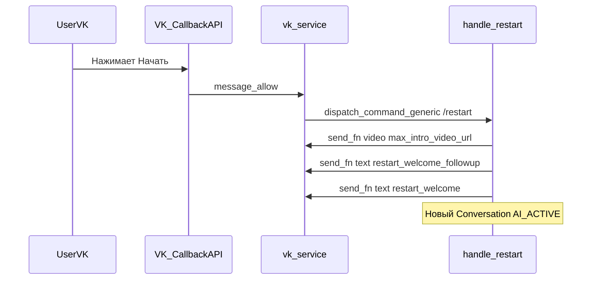
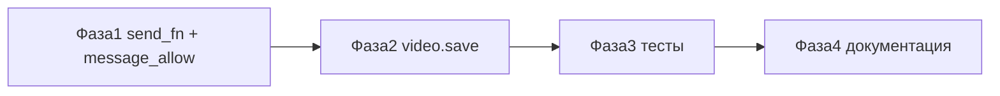

# План: автостарт VK и welcome как в Max

**Цель:** автоматизировать старт workflow во ВКонтакте без ручного `/start` — через событие `message_allow` (аналог Max `bot_started`) — и доставить welcome-поток в паритете с Max: intro-видео + followup + `restart_welcome` через общий `handle_restart`.

**Основной файл:** [`backend/app/services/vk_service.py`](../backend/app/services/vk_service.py)

---

## Контекст

Сейчас `/start` во VK работает, потому что вызывает общий [`handle_restart`](../backend/app/services/bot_commands_service.py) через `dispatch_command_generic`. Max автоматизирует это через `bot_started`; во VK аналога нет — событие `message_allow` («Разрешение на получение») уже включено в настройках Callback API, но **не обрабатывается** в коде.

Welcome-последовательность для non-Telegram каналов уже реализована в `handle_restart` (без изменений):



Ожидаемые 3 отправки (как в [`test_handle_restart_max_welcome.py`](../backend/tests/test_handle_restart_max_welcome.py)):

1. Видео — `max_intro_video_url`, `media_type="video"`, пустой текст
2. Текст — `restart_welcome_followup` (если задан)
3. Текст — `restart_welcome`

**Блокер сегодня:** во всех VK `send_fn` используется `_send_text`, который игнорирует `media_url`/`media_type`; `_upload_and_get_attachment` не поддерживает `video`.

---

## Фаза 1 — Транспорт команд: `send_fn` с медиа

**Файл:** [`backend/app/services/vk_service.py`](../backend/app/services/vk_service.py)

### 1.1 Хелпер `_make_command_send_fn`

Вынести общую фабрику `send_fn` (как в [`max_service.py`](../backend/app/services/max_service.py), строки 219–225), чтобы не дублировать lambda:

```python
def _make_command_send_fn(self, access_token: str, peer_id: int, binding: Any):
    group_id = int(binding.channel_account_id) if binding.channel_account_id else None
    async def send_fn(text, *, media_url=None, media_type=None):
        await self._send_message_raw(
            access_token, peer_id, text,
            media_url=media_url, media_type=media_type, group_id=group_id,
        )
    return send_fn
```

### 1.2 Заменить `_send_text` в существующих вызовах `dispatch_command_generic`

Обновить **2 места**:

- [`_handle_message_event`](../backend/app/services/vk_service.py) — callback `cmd == "restart"` (~строки 206–208)
- [`_handle_message_new`](../backend/app/services/vk_service.py) — команды `/start` (~строки 366–368)

### 1.3 Обработчик `message_allow`

В `handle_webhook_event()` добавить ветку **до** `message_event`:

```python
if event_type == "message_allow":
    user_id = payload.get("object", {}).get("user_id")
    if user_id:
        access_token = await channel_binding_service.get_access_token(binding_id)
        await dispatch_command_generic(
            command="/restart",
            chat_id=str(user_id),  # peer_id в личке = user_id
            binding=binding,
            send_fn=self._make_command_send_fn(access_token, int(user_id), binding),
            db=self.db,
        )
    return "ok"
```

Обновить docstring модуля: добавить `message_allow` в список обрабатываемых событий.

**Результат фазы:** `restart_welcome_followup` и `restart_welcome` гарантированно уходят; видео начнёт отправляться после фазы 2.

---

## Фаза 2 — Загрузка intro-видео через VK API

**Файл:** [`backend/app/services/vk_service.py`](../backend/app/services/vk_service.py)

Детали upload см. также в [`vk-welcome-video-plan.md`](vk-welcome-video-plan.md).

### 2.1 Расширить сигнатуры

- `_send_message_raw(..., group_id: Optional[int] = None)`
- `_upload_and_get_attachment(..., group_id: Optional[int] = None)`
- Публичный `send_message()` — резолвить `group_id` из binding по `binding_id` (для ответов агента с video)

### 2.2 Добавить `_upload_video`

Стандартный flow сообщества:

1. `GET video.save` — `group_id`, `is_private=1`, `wallpost=0`, `name="intro"`
2. Скачать MP4 по URL (httpx, timeout 60s)
3. `POST upload_url` — multipart `video_file`
4. Вернуть attachment `video{owner_id}_{video_id}`

### 2.3 Ветка в `_upload_and_get_attachment`

```python
if media_type == "image":
    return await self._upload_photo(...)
elif media_type == "video":
    return await self._upload_video(client, access_token, media_url, group_id)
else:
    ...  # audio/doc
```

### 2.4 Fallback для intro-видео

При ошибке upload intro-видео (пустой `text` + `media_type="video"`):

- логировать warning
- **не** добавлять URL в текст (в отличие от обычных ответов агента)
- продолжить welcome-текстами

Реализация: параметр `append_url_on_upload_failure: bool = True` в `_send_message_raw`, для intro передавать `False` через `send_fn` или определять по `not text and media_type == "video"`.

[`backend/app/services/channel_sender.py`](../backend/app/services/channel_sender.py) — **без изменений** (`VkSender` уже передаёт `media_url`/`media_type`).

### Риски VK API

| Риск | Митигация |
|------|-----------|
| Токен сообщества без прав на `video` | Логировать код ошибки VK; fallback на текстовый welcome |
| Видео ещё обрабатывается после upload | `asyncio.sleep(1)` уже есть в `handle_restart`; при ошибке attachment — 1–2 retry `messages.send` |
| Большой MP4 (> лимита VK) | Квадратное видео до ~60 сек, как для Max |

---

## Фаза 3 — Тесты

### 3.1 Welcome-поток VK

Создать [`backend/tests/test_handle_restart_vk_welcome.py`](../backend/tests/test_handle_restart_vk_welcome.py) по образцу Max-тестов:

| Тест | Проверка |
|------|----------|
| `test_handle_restart_vk_sends_video_followup_and_welcome` | 3 вызова `send_fn`: video + followup + welcome |
| `test_handle_restart_vk_skips_video_when_url_missing` | Только `restart_welcome` |
| `test_handle_restart_vk_uses_max_url_not_telegram_file_id` | `intro_video_note_file_id` не используется |

Binding: `ChannelType.VK`.

### 3.2 Upload video

Создать [`backend/tests/test_vk_upload_video.py`](../backend/tests/test_vk_upload_video.py):

- мок httpx: `video.save` → download → upload → `video-123_456`
- fallback: ошибка upload → сообщение без attachment, без exception

### 3.3 message_allow (опционально, unit)

Тест на `handle_webhook_event`: payload `message_allow` → один вызов `dispatch_command_generic` с `/restart`.

---

## Фаза 4 — Документация

Обновить [`vk-max-integration-guide.md`](vk-max-integration-guide.md):

- В «Типы событий» добавить **`message_allow`** («Разрешение на получение») — автостарт welcome
- Секция «Приветствие при /restart и автостарте»: поля `max_intro_video_url`, `restart_welcome_followup`, `restart_welcome` (общие с Max)
- Требования к видео: квадратный MP4, CDN, fallback на текст

---

## Конфиг агента (без изменений кода)

В `prompts.templates` агента должны быть заданы те же поля, что для Max:

| Поле | Назначение |
|------|------------|
| `max_intro_video_url` | URL квадратного MP4 (общий для VK и Max) |
| `restart_welcome_followup` | Текст после видео (опционально) |
| `restart_welcome` | Основное приветствие |

Шаблон `intro_video_note_file_id` остаётся **только для Telegram** (video_note).

---

## Настройки VK Callback API

Для автостарта должны быть включены:

- **Входящее сообщение** (`message_new`)
- **Разрешение на получение** (`message_allow`) — автостарт welcome
- **Нажатие на кнопку** (`message_event`) — для inline-кнопок workflow (отдельная задача)

---

## Критерии приёмки (AC)

1. Пользователь нажимает «Начать» во VK → получает видео, затем (если задан) followup, затем `restart_welcome` — **без** `/start`
2. `/start` и `/restart` вручную — тот же welcome-поток
3. При ошибке upload видео — тексты welcome всё равно доставляются
4. Telegram-поведение (`intro_video_note_file_id`) не регрессирует
5. Unit-тесты VK welcome и video upload проходят

---

## Вне scope (отдельные задачи)

- Fallback автостарта на **первое сообщение** без `message_allow` (для returning users)
- Quick-reply кнопки VK: `callback` → `type: text` (паритет с Max)
- `_find_or_create_conversation`: фильтр только `AI_ACTIVE`

---

## Порядок внедрения



**Оценка:** 1 PR — [`vk_service.py`](../backend/app/services/vk_service.py) + 2–3 тестовых файла + обновление гайда.

---

## Чеклист задач

- [ ] Добавить `_make_command_send_fn` и заменить `_send_text` в `message_new` / `message_event`
- [ ] Добавить обработчик `message_allow` в `handle_webhook_event` → `dispatch_command_generic(/restart)`
- [ ] Реализовать `_upload_video` + `group_id` в `_send_message_raw` / `send_message`; fallback без URL для intro
- [ ] Написать `test_handle_restart_vk_welcome.py` и `test_vk_upload_video.py`
- [ ] Обновить `vk-max-integration-guide.md`
