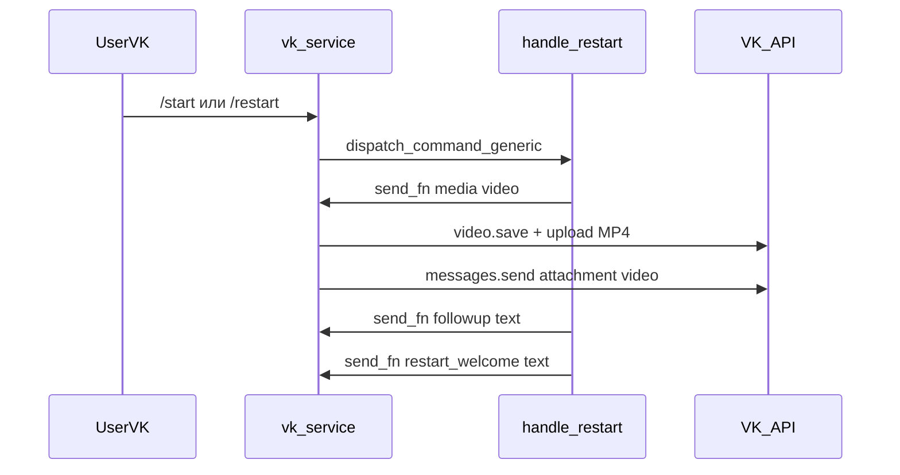
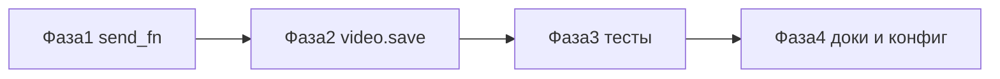

# План: welcome-сообщение и видео в VK-боте

План реализации welcome-потока для VK-канала: intro-видео и текстовые шаблоны при `/start` и `/restart`.

**Цель:** довести VK-бот до паритета с Max по welcome-потоку — отправка intro-видео из `max_intro_video_url` и корректная доставка текстов `restart_welcome` / `restart_welcome_followup`. Ключевые изменения — в `vk_service.py`: прокинуть media в `send_fn` и добавить загрузку видео через VK API `video.save`.

---

## Контекст и текущее состояние

Приветственный текст в VK **уже работает** через общий [`handle_restart`](../backend/app/services/bot_commands_service.py): при `/start`, `/restart` и inline-кнопке `cmd: "restart"` закрывается старый диалог, создаётся новый, отправляются шаблоны из `agent.config.prompts.templates`.

Видео **не доставляется** по двум причинам:

1. В [`vk_service.py`](../backend/app/services/vk_service.py) `send_fn` для команд передаёт только текст в `_send_text`, игнорируя `media_url` / `media_type`:

```366:368:backend/app/services/vk_service.py
send_fn=lambda text, *, media_url=None, media_type=None: self._send_text(
    access_token, int(peer_id_str), text
),
```

2. [`_upload_and_get_attachment`](../backend/app/services/vk_service.py) поддерживает только `image`, `audio` и `doc` — ветки `video` нет.

Для сравнения, Max уже реализован правильно: `send_fn` вызывает `_send_message_raw` с медиа, а видео грузится через `/uploads`.

```219:225:backend/app/services/max_service.py
send_fn=lambda text, *, media_url=None, media_type=None: self._send_message_raw(
    access_token, int(chat_id), text,
    media_url=media_url, media_type=media_type,
),
```

---

## Целевое поведение

При `/start` или `/restart` в VK (если в конфиге агента заданы шаблоны):

| Шаг | Источник | Содержимое |
|-----|----------|------------|
| 1 | `max_intro_video_url` | Intro-видео (квадратное MP4 с CDN) |
| 2 | `restart_welcome_followup` | Опциональный текст после видео |
| 3 | `restart_welcome` | Основное приветствие |

Порядок и логика **не меняются** в [`handle_restart`](../backend/app/services/bot_commands_service.py) — меняется только транспорт VK.

Шаблон `intro_video_note_file_id` остаётся **только для Telegram** (video_note).

Переименовывать `max_intro_video_url` не требуется: поле уже используется как общий URL для всех non-Telegram каналов (VK + Max).



---

## Фаза 1 — Прокинуть media в send_fn (критический фикс)

**Файл:** [`backend/app/services/vk_service.py`](../backend/app/services/vk_service.py)

Заменить `_send_text` на `_send_message_raw` в **трёх** местах:

- обработка текстовых команд (`message_new`, строки ~366–368);
- callback `cmd == "restart"` (строки ~206–208);
- при необходимости — любые другие вызовы `dispatch_command_generic` в этом файле.

Новая сигнатура lambda (по аналогии с Max):

```python
send_fn=lambda text, *, media_url=None, media_type=None: self._send_message_raw(
    access_token,
    int(peer_id_str),
    text,
    media_url=media_url,
    media_type=media_type,
    group_id=int(binding.channel_account_id),  # для video.save
)
```

`group_id` берётся из `binding.channel_account_id` (VK Group ID, уже документирован в шапке файла).

**Результат фазы:** `restart_welcome_followup` и `restart_welcome` гарантированно уходят; видео начнёт пытаться отправляться (пока упадёт на upload).

---

## Фаза 2 — Загрузка и отправка video в VK API

**Файл:** [`backend/app/services/vk_service.py`](../backend/app/services/vk_service.py)

### 2.1 Расширить `_send_message_raw`

Добавить опциональный параметр `group_id: Optional[int] = None` и передавать его в `_upload_and_get_attachment`.

### 2.2 Добавить `_upload_video`

Алгоритм (стандартный VK flow для сообществ):

1. `GET video.save` с параметрами:
   - `group_id` — ID сообщества из binding;
   - `is_private=1` — видео можно отправлять в личные сообщения;
   - `wallpost=0` — не публиковать на стене;
   - `name` — например `"intro"`.
2. Скачать MP4 по `media_url` (httpx, timeout 60s).
3. `POST upload_url` с полем `video_file` (multipart).
4. Собрать attachment: `video{owner_id}_{video_id}` из ответа `video.save` / upload.

### 2.3 Обновить `_upload_and_get_attachment`

```python
if media_type == "image":
    return await self._upload_photo(...)
elif media_type == "video":
    return await self._upload_video(client, access_token, media_url, group_id)
else:
    ...
```

### 2.4 Fallback при ошибке

Сохранить текущий паттерн Max/VK: при сбое upload — `logger.warning`, не падать, продолжить welcome-текстом. URL в текст **не** добавлять для intro-видео (только для обычных ответов агента, как сейчас).

### 2.5 Прокинуть `group_id` в публичный `send_message`

В [`send_message`](../backend/app/services/vk_service.py) (используется `VkSender` для ответов агента) резолвить `group_id` из binding по `binding_id`, чтобы исходящее `media_type="video"` тоже работало.

**Файл:** [`backend/app/services/channel_sender.py`](../backend/app/services/channel_sender.py) — изменений не требуется, `VkSender` уже передаёт `media_url` / `media_type`.

### Риски VK API

| Риск | Митигация |
|------|-----------|
| Токен сообщества без прав на `video` | Логировать код ошибки VK; fallback на текстовый welcome |
| Видео ещё обрабатывается после upload | `asyncio.sleep(1)` уже есть в `handle_restart`; при ошибке attachment — 1–2 retry `messages.send` |
| Большой MP4 (> лимита VK) | Документировать в гайде: квадратное видео до ~60 сек, как для Max |

---

## Фаза 3 — Тесты

Создать [`backend/tests/test_handle_restart_vk_welcome.py`](../backend/tests/test_handle_restart_vk_welcome.py) по образцу [`test_handle_restart_max_welcome.py`](../backend/tests/test_handle_restart_max_welcome.py):

- `test_handle_restart_vk_sends_video_followup_and_welcome` — 3 вызова send_fn с корректными `media_url` / `media_type` / текстами;
- `test_handle_restart_vk_skips_video_when_url_missing` — только `restart_welcome`;
- `test_handle_restart_vk_uses_max_url_not_telegram_file_id` — `intro_video_note_file_id` не используется для VK.

Создать [`backend/tests/test_vk_upload_video.py`](../backend/tests/test_vk_upload_video.py):

- мок httpx: `video.save` → download URL → upload → attachment `video-123_456`;
- тест fallback: ошибка upload → сообщение уходит без attachment, без exception.

---

## Фаза 4 — Документация и конфиг агента

**Файл:** [`docs/vk-max-integration-guide.md`](vk-max-integration-guide.md)

Добавить секцию «Приветствие при /restart»:

- какие поля в `prompts.templates` используются VK;
- что `max_intro_video_url` общий для VK и Max;
- требования к видео (формат, длительность, CDN);
- поведение fallback.

**Контент агента:** прописать `max_intro_video_url` (и при необходимости `restart_welcome_followup`) в конфиге продакшен-агента «Дай Лапу» — тот же URL, что уже используется для Max.

Изменения в `handle_restart` и frontend **не требуются** — шаблоны уже читаются из `prompts.templates`.

---

## Вне scope (опционально, отдельная задача)

- **Входящее video от пользователя:** сейчас VK Callback API отдаёт только превью (`media_type=image`, текст `[Видеосообщение]`). Для полноценного анализа видео нужен отдельный pipeline (`video.get` + скачивание / STT) — это не блокирует welcome.
- **Авто-приветствие без /restart:** в VK нет события аналога Max `bot_started`; первое обычное сообщение не триггерит welcome. Если нужно — отдельная фича при создании первого conversation.
- **Переименование `max_intro_video_url` → `intro_video_url`:** косметика, не даёт функциональной ценности сейчас.

---

## Критерии приёмки (AC)

1. VK `/start` или `/restart` с заданным `max_intro_video_url` → пользователь получает видео, затем (если задан) `restart_welcome_followup`, затем `restart_welcome`.
2. При отсутствии URL → только текстовый welcome (как сейчас в Max).
3. При ошибке upload видео → welcome-тексты всё равно доставляются, в логах — warning.
4. Telegram-поведение (`intro_video_note_file_id`) не регрессирует.
5. Unit-тесты VK welcome и video upload проходят в CI.

---

## Порядок внедрения



**Оценка:** ~1 PR, 2–3 файла кода + 2 тестовых файла + документация.

---

## Чеклист задач

- [ ] Заменить `send_fn` в `vk_service.py`: `_send_text` → `_send_message_raw` с `media_url` / `media_type` и `group_id` (3 места)
- [ ] Добавить `_upload_video` через VK `video.save` + multipart upload; расширить `_upload_and_get_attachment` и `send_message`
- [ ] Написать `test_handle_restart_vk_welcome.py` и `test_vk_upload_video.py` по образцу Max-тестов
- [ ] Обновить `vk-max-integration-guide.md`; прописать `max_intro_video_url` в конфиге агента
